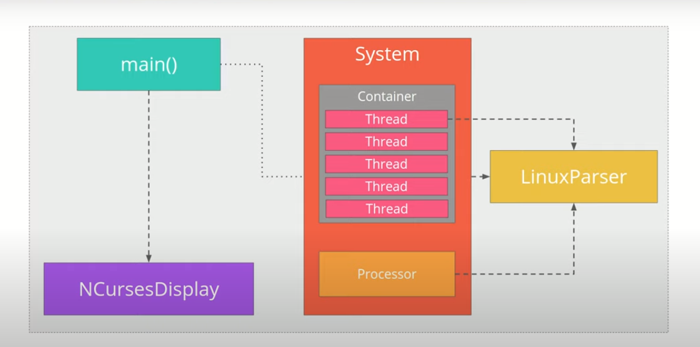

# CppND-System-Monitor
linux operating system process managers from udacity c++ NanoDegree program.

## Dependencies
* cmake >= 3.11.3
  * All OSes: [click here for installation instructions](https://cmake.org/install/)
* make >= 4.1 (Linux, Mac), 3.81 (Windows)
  * Linux: make is installed by default on most Linux distros
  * Mac: [install Xcode command line tools to get make](https://developer.apple.com/xcode/features/)
  * Windows: [Click here for installation instructions](http://gnuwin32.sourceforge.net/packages/make.htm)
* gcc/g++ >= 7.4.0
  * Linux: gcc / g++ is installed by default on most Linux distros
  * Mac: same instructions as make - [install Xcode command line tools](https://developer.apple.com/xcode/features/)
  * Windows: recommend using [MinGW](http://www.mingw.org/)
* ncurses
  * [ncurses](https://www.gnu.org/software/ncurses/) is a library that facilitates text-based graphical output in the terminal. This         project relies on ncurses for display output.
  * install ncurses within your own Linux environment: `sudo apt install libncurses5-dev libncursesw5-dev`

## Make
This project uses [Make](https://www.gnu.org/software/make/). The Makefile has four targets:
* `build` compiles the source code and generates an executable
* `format` applies [ClangFormat](https://clang.llvm.org/docs/ClangFormat.html) to style the source code
* `debug` compiles the source code and generates an executable, including debugging symbols
* `clean` deletes the `build/` directory, including all of the build artifacts

## Instructions

1. Clone the project repository: `git clone https://github.com/udacity/CppND-System-Monitor-Project-Updated.git`

2. Build the project: `make build`

3. Run the resulting executable: `./build/monitor`

## Architecture

